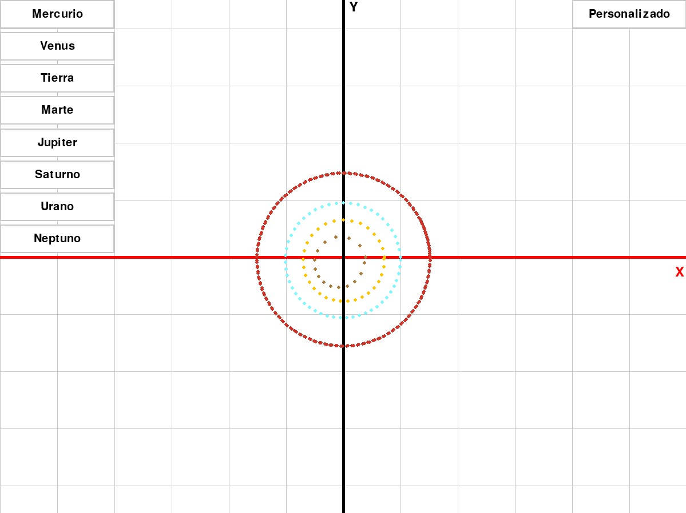
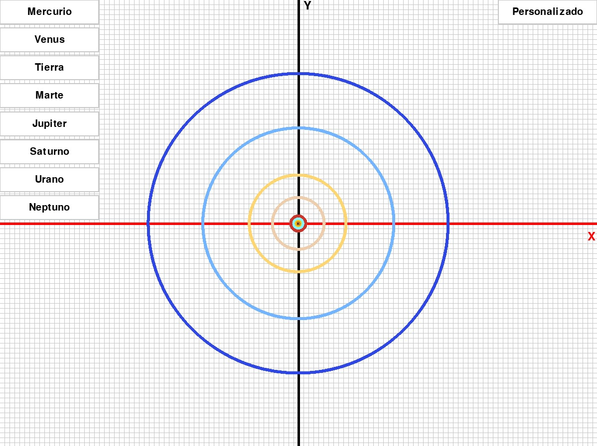

# Simulador de órbitas

## Descripción

Este programa tiene la capacidad de graficar las órbitas de los 8 planetas del sistema solar, además de un planeta personalizado por el usuario haciendo uso de fórmulas físicas y métodos numéricos.

## Gráfica de órbitas planetarias

A continuación se muestra el programa con los planetas más cercanos al sol:

Y aquí se muestra el programa con todos los planetas del sistema solar:

Finalmente, aquí tenemos las órbitas de un planeta personalizado, el cual deja un rastro bastante espectacular:

## Dependencias

El proyecto usa un par de librerías para su funcionamiento, cada una de ellas será explicada más adelante.

En el archivo requirements.txt están contenidas todas las dependencias de este proyecto, junto con la versión que fue utilizada.

Para instalar todas las dependencias contenidas en el archivo, debe ejecutarse el siguiente comando en la terminal:

    pip install -r requirements.txt

### Pygame

Librería sobre la que se basa este proyecto.

Para instalar pygame en Windows, debes tener Python instalado y asegurarte de que sus variables de entorno estén configuradas.

Una vez hecho eso, usa este comando en una terminal:

    pip install pygame

### Numpy

Libreria para resolver ecuaciones y así poder graficarlas.

    pip install numpy
